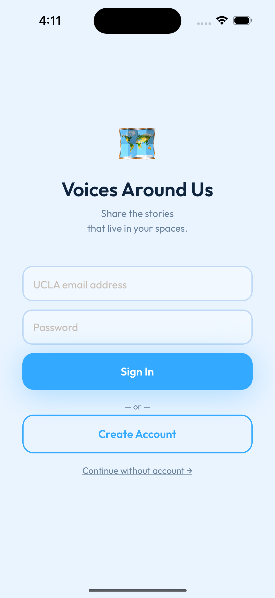
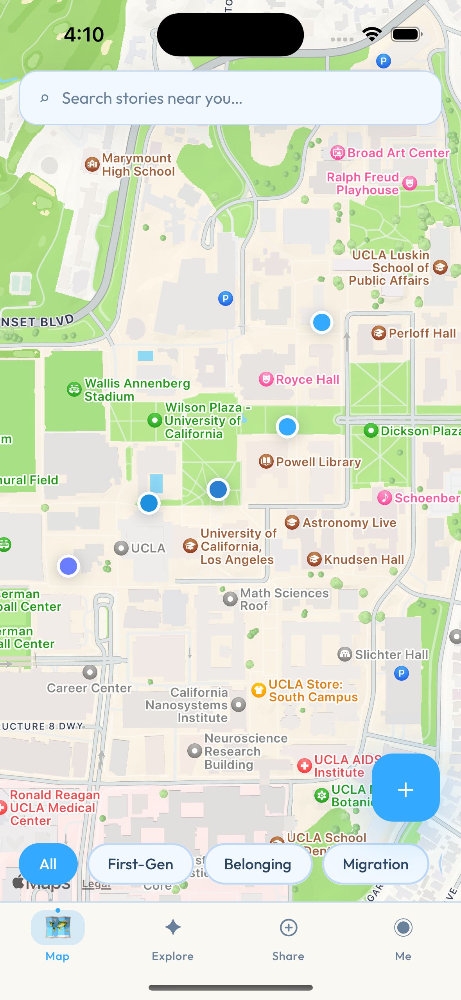
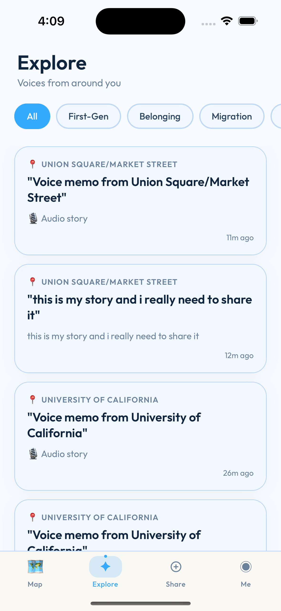
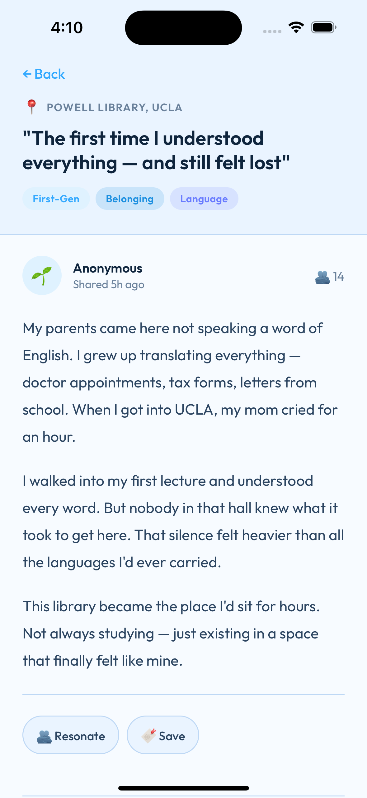
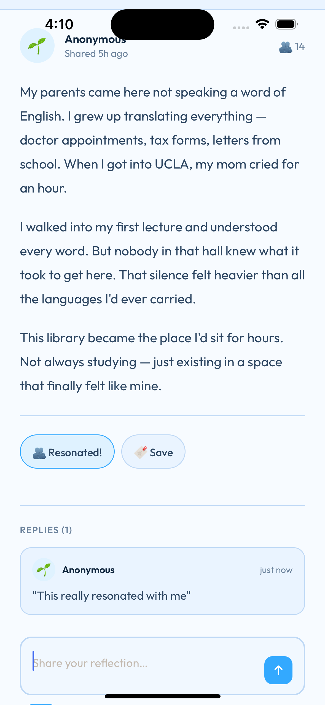
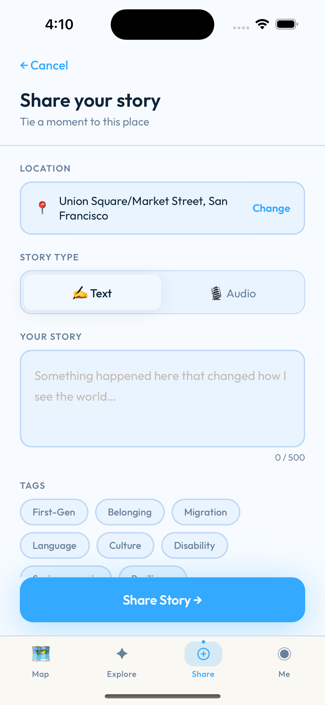
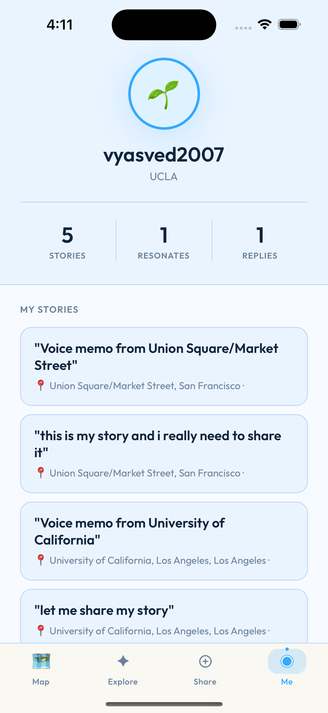

# Voices Around Us

Voices Around Us is a mobile-first storytelling app where people pin short stories (text or audio) to real-world locations. Stories are discoverable on a map and can be explored by place, tags, and community responses.

## Product Highlights

- Location-based story pins on an interactive map
- Text and audio story submission (up to 2 minutes for audio)
- Story detail view with replies and resonates
- Tag-driven discovery and filtering
- Optional anonymous posting
- Audio transcription pipeline using Supabase Edge Functions + OpenAI

## Screenshots

### 1) Login


### 2) Map View


### 3) Explore


### 4) Story Feed


### 5) Community Feedback


### 6) Share Story


### 7) Profile


## Tech Stack

- React Native + Expo (SDK 54)
- React Navigation
- react-native-maps (MapKit/Google Maps provider)
- Supabase (Auth, Postgres, Storage, Edge Functions)
- OpenAI Audio Transcription API (via Edge Function)

## Project Structure

- `VoicesAroundUs/` - React Native Expo app
- `screenshots/` - App screenshots used in this README
- `supabase/functions/transcribe-story-audio/` - Edge Function for transcription
- `migration-add-transcription.sql` - Adds transcript fields to `stories`

## Local Development

From the repo root:

```bash
cd VoicesAroundUs
npm install
npx expo start
```

For tunnel mode:

```bash
npx expo start --tunnel
```

## Supabase Setup (Transcription)

1. Run SQL migration:
   - `migration-add-transcription.sql`
2. Ensure storage bucket exists:
   - `story-audio` (public read or accessible by function runtime)
3. Deploy edge function from repo root:

```bash
npx supabase functions deploy transcribe-story-audio
```

4. Set OpenAI secret in Supabase:

```bash
npx supabase secrets set OPENAI_API_KEY=sk-...
```

5. Keep JWT verification disabled for this function (configured in `supabase/config.toml`):
   - `[functions.transcribe-story-audio]`
   - `verify_jwt = false`

## Notes

- `.env` is local-only and should not be committed.
- `node_modules/` should remain untracked.
